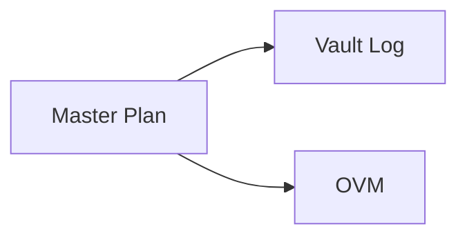

# Obsidian Format Reference

Use this reference when generating or editing notes in an Obsidian vault. Prefer Obsidian-native syntax for internal navigation, metadata, and structured annotations.

Sources: Obsidian Help — [Basic formatting syntax](https://obsidian.md/help/syntax), [Properties](https://obsidian.md/help/properties), [Callouts](https://obsidian.md/help/callouts).

## Authoring rules for vault notes

1. Use wikilinks for internal vault references: `[[Note]]`, `[[Note|Alias]]`, `[[Note#Heading]]`.
2. Use Markdown links only for external URLs: `[label](https://example.com)`.
3. Keep frontmatter valid YAML and place it at the very start of the file.
4. Quote wikilinks inside YAML properties: `source: "[[Some Note]]"`.
5. Use callouts for warnings, summaries, decisions, and todos that should stand out in Reading view.
6. Do not invent nested YAML properties for generated notes; keep properties flat and machine-readable.

## Wikilinks and embeds

| Purpose | Syntax | Notes |
| --- | --- | --- |
| Note link | `[[Project Plan]]` | Preferred for internal vault notes. |
| Alias | `[[Project Plan|plan]]` | Use when the display text should be shorter. |
| Heading link | `[[Project Plan#Risks]]` | Link directly to a heading. |
| Block link | `[[Project Plan#^block-id]]` | Use only when a stable block ID exists. |
| Note embed | `![[Project Plan]]` | Embeds another note inline. |
| Asset embed | `![[diagram.png]]` | Use for existing vault assets; do not create image assets unless requested. |

When a target note is known by path, include enough path context to disambiguate:

```md
[[20_Projects/claude-kit/_index|claude-kit]]
[[30_Notes/api-design]]
```

### Block IDs

Block IDs let you target a specific paragraph, list item, or quote with `[[Note#^block-id]]`. Append the ID with `^` at the end of the block. For list items or block quotes, place the ID on its own line.

```md
This paragraph can be linked from elsewhere. ^summary-2026-05

- First item ^item-a
- Second item

> A quoted insight worth referencing.
> ^quote-key
```

Use lowercase letters, digits, and hyphens. IDs must be unique within a note.

## Properties / YAML frontmatter

Properties are YAML frontmatter fields. Keep generated properties flat, unique per note, and easy to parse.

```yaml
---
created: 2026-05-02
tags:
  - note
  - obsidian
  - reference
type: note
status: active
related:
  - "[[20_Projects/claude-kit/_index]]"
publish: false
reviewed_at: 2026-05-02T18:30:00
---
```

### Property type guide

| Type | Preferred YAML | Notes |
| --- | --- | --- |
| Text | `title: Obsidian format` | Single-line text. Markdown is not rendered inside properties. |
| List | <code>aliases:<br>  - Format Guide<br>  - OVM Format</code> | Use block lists for multi-value fields. |
| Number | `priority: 2` | Use literal integers or decimals, not expressions. |
| Checkbox | `publish: false` | Use `true` / `false`. |
| Date | `created: 2026-05-02` | Use ISO `YYYY-MM-DD` for generated notes. |
| Date & time | `captured_at: 2026-05-02T18:30:00` | Use ISO-like local time unless a workflow requires UTC. |
| Tags | <code>tags:<br>  - capture<br>  - project/foo</code> | Tags are a list. Inline YAML lists are acceptable for short existing templates. |
| Internal link | `project: "[[Project]]"` | Quote wikilinks in YAML values. |
| CSS classes | <code>cssclasses:<br>  - dense-tables</code> | Apply CSS classes to the note for theme-specific styling (treated as a list). |

## Tags

Use tags for broad classification, not for every concept mentioned in the body.

```md
#project/active
#domain/devops
```

In frontmatter, prefer YAML lists:

```yaml
tags:
  - project
  - domain/devops
```

## Callouts

Callouts are blockquotes with a type marker on the first line.

```md
> [!note] Summary
> Key context that should remain visible.
```

Common types:

| Type | Use for |
| --- | --- |
| `[!note]` | Neutral notes and summaries |
| `[!info]` | Background context |
| `[!tip]` | Helpful usage guidance |
| `[!todo]` | Action items |
| `[!question]` | Open questions |
| `[!warning]` | Risks or constraints |
| `[!danger]` | Data-loss/security warnings |
| `[!success]` | Completed outcomes |
| `[!failure]` | Failed checks or blockers |

Foldable callouts add `+` or `-` immediately after the type:

```md
> [!question]- Open decision
> Collapsed by default until the reader expands it.
```

Nested callouts use additional blockquote markers:

```md
> [!warning] Risk
> Primary risk statement.
> > [!todo] Mitigation
> > Follow-up action.
```

## Comments

Use Obsidian comments for generator notes that should not render in Reading view:

```md
%% internal note: generated from capture workflow %%
```

Do not store sensitive information in comments; comments remain in the Markdown file.

## Highlights and inline emphasis

`==text==` renders as a yellow-background ==highlight== in Reading view. Useful for review markers, captured insights, or snippets you intend to revisit.

Standard inline emphasis:

- `*italic*` → *italic*
- `**bold**` → **bold**
- `~~strikethrough~~` → ~~strikethrough~~
- `==highlight==` → ==highlight==
- `` `inline code` `` → `inline code`

## Math (LaTeX)

Obsidian renders LaTeX math via MathJax.

- Inline: `$E = mc^2$` renders inline with surrounding text.
- Block: surround the expression with `$$ ... $$` on its own lines:

$$
\sum_{i=1}^{n} x_i = \mu n
$$

Avoid math in headings or property values; keep it in body prose or callouts.

## Diagrams (Mermaid)

Use Mermaid blocks for inline diagrams. To make a node link to another vault note, add `class NodeId internal-link` and write the node text exactly as the target note title — Obsidian resolves it as a wikilink in Reading view.



Keep diagrams short — large ones hurt readability and embed performance.

## Footnotes

Numbered footnote with a definition placed at the bottom of the note:

```md
Markdown supports footnotes[^1].

[^1]: Definition text appears at the bottom of the rendered note.
```

Inline footnote (definition right at the reference site):

```md
Inline footnote example.^[Short note inlined; rendered at the bottom.]
```

Use footnotes for citations, expanded context, or sources without breaking prose flow.

## Task lists

Use task lists for actionable checklist items:

```md
- [ ] Confirm project link
- [x] Create initial note
```

## Good generated-note skeleton

```md
---
created: 2026-05-02
tags:
  - note
  - api-design
type: note
also_related_projects:
  - claude-kit
---
# API design note

> [!note] Summary
> One-paragraph summary of the note.

## Context

Link related vault material with `[[wikilinks]]`.

## Details

Use ordinary Markdown for prose and tables.

## Next actions

- [ ] Follow-up task
```
